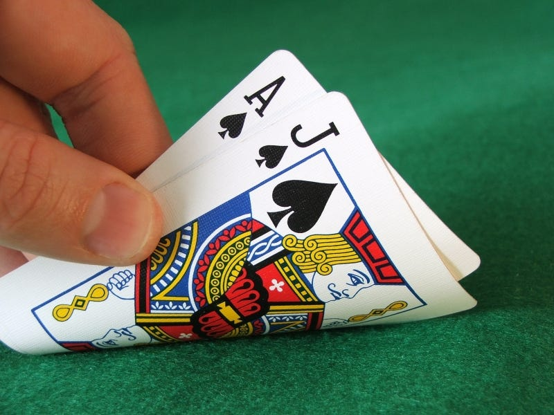

<!-- Improved compatibility of back to top link: See: https://github.com/othneildrew/Best-README-Template/pull/73 -->
<a id="readme-top"></a>

<!-- PROJECT LOGO -->
<br />
<div align="center">
  <a href="https://github.com/zakaahmed1/Blackjack_Game">
    
  </a>

<h3 align="center">Blackjack Game</h3>

  <p align="center">
    A Python script that simulates a game of Blackjack (21). Includes abilities to bet fictional money, along with all usual blackjack options such as splitting and doubling down.
    <br />
    <a href="https://github.com/zakaahmed1/Blackjack_Game"><strong>Explore the docs »</strong></a>
    <br />
    <br />
    <a href="https://github.com/zakaahmed1/Blackjack_Game">View Demo</a>
    ·
    <a href="https://github.com/zakaahmed1/Blackjack_Game/issues/new?labels=bug&template=bug-report---.md">Report Bug</a>
    ·
    <a href=https://github.com/zakaahmed1/Blackjack_Game/issues/new?labels=enhancement&template=feature-request---.md">Request Feature</a>
  </p>
</div>


<!-- TABLE OF CONTENTS -->
<details>
  <summary>Table of Contents</summary>
  <ol>
        <li><a href="#built-with">Built With</a></li>
      </ul>
    </li>
    <li><a href="#about-this-project">About this project</a></li>
    <li>
      <a href="#getting-started">Getting Started</a>
      <ul>
        <li><a href="#prerequisites">Prerequisites</a></li>
      </ul>
    </li>
    <li><a href="#usage">Usage</a></li>
    <li><a href="#contributing">Contributing</a></li>
    <li><a href="#contact">Contact</a></li>
  </ol>
</details>


### Built With

* [![Python][Python.com]][Python-url]

<p align="right">(<a href="#readme-top">back to top</a>)</p>


<!-- ABOUT THIS PROJECT -->
## About this project

**Blackjack**, also known as **21**, is one of the most popular card games. It is played between one or more players and a dealer, where the players do not compete against each other but against the dealer.

#### Objective:
The goal of Blackjack is to beat the dealer by having a hand value as close to **21** as possible without going over.

#### Card Values:
- Number cards (2-10): Count as their face value.
- Face cards (Jack, Queen, King): Count as 10.
- Aces: Count as either 1 or 11, depending on which value benefits the player’s hand.

#### How to Play:
1. **Initial Deal**: 
   - Each player is dealt two cards face up.
   - The dealer receives one card face up and one card face down.

2. **Gameplay Options**:
   - **Hit**: Take another card from the deck.
   - **Stand**: Keep your current hand and end your turn.
   - **Double Down**: Double your initial bet, take one additional card, and then stand.
   - **Split**: If your first two cards are of equal value (e.g., two 8s or a 10 and a Jack), you can split them into two separate hands, each with its own bet.

3. **Dealer's Turn**:
   - The dealer reveals the face-down card and must draw cards until their hand value is at least **17**.
   - If the dealer exceeds 21, they bust, and all remaining players win.

4. **Winning Conditions**:
   - **Blackjack**: A hand consisting of an Ace and a 10-value card on the initial deal.
   - **Beat the Dealer**: Have a hand value closer to 21 than the dealer's without exceeding 21.
   - **Push**: If both the player and the dealer have the same hand value, it's a tie, and the player’s bet is returned.

#### Betting:
Before the cards are dealt, each player places a bet. Winnings are typically paid at 1:1, except for a Blackjack, which usually pays 3:2.

Since the dealer plays last, they always have a slight advantage statistically over the players. To give the player the best probability to be successful, there is a *Blackjack basic strategy* which identifies the best possible actions for the player based on every combination of their hand and the dealer's hand.

Here's a Markdown table for the **Blackjack Basic Strategy**. The table assumes the game is played with standard rules: 4–8 decks, dealer stands on soft 17, and doubling down is allowed.

# Blackjack Basic Strategy Table

| **Player Hand**         | **Dealer's Upcard**         | **Action**                    |
|--------------------------|-----------------------------|--------------------------------|
| **Hard Totals**          |                             |                                |
| 5–8                      | Any                        | Hit                            |
| 9                        | 3–6                        | Double Down (otherwise Hit)    |
| 10                       | 2–9                        | Double Down (otherwise Hit)    |
| 11                       | 2–10                       | Double Down (otherwise Hit)    |
| 12                       | 4–6                        | Stand (otherwise Hit)          |
| 13–16                    | 2–6                        | Stand (otherwise Hit)          |
| 17–21                    | Any                        | Stand                          |
| **Soft Totals**          |                             |                                |
| A,2                     | 5–6                        | Double Down (otherwise Hit)    |
| A,3                     | 5–6                        | Double Down (otherwise Hit)    |
| A,4                     | 4–6                        | Double Down (otherwise Hit)    |
| A,5                     | 4–6                        | Double Down (otherwise Hit)    |
| A,6                     | 3–6                        | Double Down (otherwise Hit)    |
| A,7                     | 2,7,8                      | Stand                          |
| A,7                     | 3–6                        | Double Down                    |
| A,7                     | 9–A                        | Hit                            |
| A,8                     | 6                          | Double Down (otherwise Stand)  |
| A,8 or higher            | Any                        | Stand                          |
| **Pairs**                |                             |                                |
| 2,2                     | 2–7                        | Split                          |
| 3,3                     | 2–7                        | Split                          |
| 4,4                     | 5–6                        | Split                          |
| 5,5                     | Any                        | Treat as Hard 10               |
| 6,6                     | 2–6                        | Split                          |
| 7,7                     | 2–7                        | Split                          |
| 8,8                     | Any                        | Split                          |
| 9,9                     | 2–6, 8–9                   | Split                          |
| 10,10                   | Any                        | Stand                          |
| A,A                     | Any                        | Split                          |


<!-- GETTING STARTED -->
## Getting Started

For this project we simply need Python and some additional packages to handle sounds and colors (details listed below in <a href="#prerequisites">Prerequisites</a>). Make sure to download the entire repository as the code needs the .mp3 files to be able to run.

### Prerequisites

For this blackjack game, we need to install additional packages before running the code. We need to install the **pygame** package to play the sounds associated with shuffling, dealing, and winning/losing. We also need to install the **colorama** package to display colors.
* python
  ```python
  pip install pygame colorama
  ```


<!-- USAGE EXAMPLES -->
## Usage

Use this space to show useful examples of how a project can be used. Additional screenshots, code examples and demos work well in this space. You may also link to more resources.

_For more examples, please refer to the [Documentation](https://example.com)_

<p align="right">(<a href="#readme-top">back to top</a>)</p>


<!-- CONTRIBUTING -->
## Contributing

Contributions are what make the open source community such an amazing place to learn, inspire, and create. Any contributions you make are **greatly appreciated**.

If you have a suggestion that would make this better, please fork the repo and create a pull request. You can also simply open an issue with the tag "enhancement".
Don't forget to give the project a star! Thanks again!

1. Fork the Project
2. Create your Feature Branch (`git checkout -b feature/AmazingFeature`)
3. Commit your Changes (`git commit -m 'Add some AmazingFeature'`)
4. Push to the Branch (`git push origin feature/AmazingFeature`)
5. Open a Pull Request

<p align="right">(<a href="#readme-top">back to top</a>)</p>

### Top contributors:

<a href="https://github.com/zakaahmed1/Blackjack_Game/graphs/contributors">
  
</a>


<!-- CONTACT -->
## Contact

Zaka Ahmed - zakaahmed1@hotmail.com

Project Link: [https://github.com/zakaahmed1/Blackjack_Game](https://github.com/zakaahmed1/Blackjack_Game)

<p align="right">(<a href="#readme-top">back to top</a>)</p>


<!-- MARKDOWN LINKS & IMAGES -->
<!-- https://www.markdownguide.org/basic-syntax/#reference-style-links -->
[contributors-shield]: https://img.shields.io/github/contributors/github_username/repo_name.svg?style=for-the-badge
[contributors-url]: [https://github.com/github_username/repo_name](https://github.com/zakaahmed1/Blackjack_Game)/graphs/contributors
[forks-shield]: https://img.shields.io/github/forks/github_username/repo_name.svg?style=for-the-badge
[forks-url]: https://github.com/zakaahmed1/Blackjack_Game/network/members
[stars-shield]: https://img.shields.io/github/stars/github_username/repo_name.svg?style=for-the-badge
[stars-url]: https://github.com/zakaahmed1/Blackjack_Game/stargazers
[issues-shield]: https://img.shields.io/github/issues/github_username/repo_name.svg?style=for-the-badge
[issues-url]: https://github.com/zakaahmed1/Blackjack_Game/issues
[license-shield]: https://img.shields.io/github/license/github_username/repo_name.svg?style=for-the-badge
[license-url]: https://github.com/zakaahmed1/Blackjack_Game/blob/master/LICENSE.txt
[linkedin-shield]: https://img.shields.io/badge/-LinkedIn-black.svg?style=for-the-badge&logo=linkedin&colorB=555
[linkedin-url]: https://uk.linkedin.com/in/zakaahmed
[Python.com]: https://img.shields.io/badge/python-3670A0?style=for-the-badge&logo=python&logoColor=ffdd54
[Python-url]: https://www.python.org/
